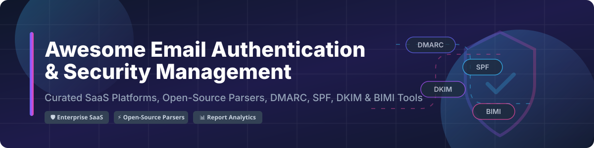

# 📧 Awesome Email Authentication & Security Management 🛡️

  

  
  
  
  
  

---

## 🚀 Overview & Market Landscape

Welcome to the **Awesome Email Authentication & Security Management** directory! This repository tracks top **SaaS platforms** and **Open-Source GitHub projects** for managing **DMARC enforcement**, **SPF alignment & flattening**, **DKIM signature validation**, **MTA-STS**, and **BIMI (Brand Indicators for Message Identification)** deployment.

### 📊 Sector Market Size & Industry Dynamics

> 💡 **Market Size & Structure**: The global Email Fraud Defense and DMARC Security market size is estimated at **$1.8 Billion – $2.5 Billion+**, growing at a CAGR of ~22%. The market is **moderately fragmented**: enterprise email security suites (such as Proofpoint and Mimecast) dominate large enterprise suites, while specialized pure-play DMARC providers (Valimail, Red Sift, EasyDMARC) and flexible open-source self-hosted parsers capture the growing SMB, MSP, and developer landscape.

---

## 📑 Table of Contents

- [🏢 SaaS / Hosted Platforms](#-saas--hosted-platforms)
- [⚡ Open-Source GitHub Projects](#-open-source-github-projects)
- [🤝 How to Contribute](#-how-to-contribute)
- [💖 Support & Sponsorship](#-support--sponsorship)
- [📈 Star History](#-star-history)
- [⚠️ Disclaimer](#%EF%B8%8F-disclaimer)

---

## 🏢 SaaS / Hosted Platforms

Below is a detailed comparison of enterprise and SMB SaaS products for DMARC monitoring, SPF flattening, and email security enforcement, sorted by estimated company size / market valuation (descending).

| Platform / Product | Description | Starting Paid Pricing | Free Tier / Trial Limit | Est. Company Size / Valuation |
| :--- | :--- | :--- | :--- | :--- |
| 🛡️ **[Proofpoint Email Fraud Defense](https://www.proofpoint.com/)** | Enterprise email fraud protection with automated DMARC enforcement & supply chain defense. | ~$3.00 – $6.00 / user / month (Enterprise quotes) | 30-Day Free Enterprise Demo Trial | **~$12.3 Billion** (Acquired by Thoma Bravo; ~$2.5B annual revenue) |
| 📧 **[Mimecast DMARC Analyzer](https://www.mimecast.com/)** | Integrated DMARC reporting module within Mimecast's email security & gateway suite. | ~$3.50 / user / month (Security suite bundle) | 30-Day Free Trial (Mimecast Suite) | **~$5.8 Billion** (Acquired by Permira; ~$650M annual revenue) |
| 🔴 **[Red Sift OnDMARC](https://redsift.com/)** | Enterprise DMARC, BIMI, MTA-STS, and automated SPF dynamic record management. | $49 / month (Essentials Plan) | 14-Day Free Trial (Full features, no credit card required) | **~$300 Million+** (Series B funded, $54M+ total raised) |
| 🔒 **[Valimail](https://www.valimail.com/)** | Zero-touch automated DMARC enforcement, continuous monitoring, and BIMI readiness. | $499 / month (Valimail Enforce) | Free forever (Valimail Align: 1 domain, basic aggregate visibility) | **~$200 Million+** ($85M+ venture funding raised) |
| ⚡ **[EasyDMARC](https://easydmarc.com/)** | All-in-one DMARC solution for SMBs and MSPs with SPF flattening & reputation tracking. | $35 / month (Plus Plan) | Free forever (1 domain, up to 10,000 DMARC aggregate compliance reports/mo) | **~$100 Million+** (Series A funded, $20M+ raised) |
| 🔑 **[dmarcian](https://dmarcian.com/)** | Veteran DMARC management platform offering step-by-step enforcement guidance. | $24 / month (Basic Plan) | Free forever (1 domain, up to 10,000 DMARC aggregate compliance reports/mo) | **~$50 Million – $100 Million** (Bootstrapped / Profitable market leader) |
| 🛡️ **[Sendmarc](https://sendmarc.com/)** | DMARC & BIMI enforcement platform with MSP multi-tenancy and 90-day enforcement guarantee. | $49 / month (Professional Plan) | 14-Day Free Trial (Unlimited domains during trial) | **~$35 Million – $70 Million** (Series A funded, $7M+ raised) |
| 🚀 **[PowerDMARC](https://powerdmarc.com/)** | Multi-tenant DMARC, SPF, DKIM, MTA-STS, and BIMI platform with white-labeling for MSPs. | $9.99 / month (Basic Plan) | 15-Day Free Trial (Full MSP features, 10,000 reports) | **~$20 Million – $50 Million** (Rapidly growing bootstrapped/backed MSP provider) |
| 🌐 **[URIports](https://www.uriports.com/)** | Lightweight, high-performance domain security monitoring for DMARC, TLS-RPT, CSP, and Certificate Transparency. | $1.02 / month ($12/yr starting tier) | 30-Day Free Trial (Full platform features up to 100,000 reports) | **~$5 Million – $15 Million** (Independent profitable SaaS) |
| 📊 **[DMARCLY](https://dmarcly.com/)** | Streamlined DMARC, SPF flattener, DKIM, and hosted DMARC record management for IT teams. | $18 / month (Basic Plan) | 14-Day Free Trial (1 domain, full features) | **~$5 Million – $10 Million** (Independent bootstrapped SaaS) |

---

## ⚡ Open-Source GitHub Projects

Self-hosted email authentication parsers, validation libraries, and domain checkers. Sorted by GitHub Star count (descending).

| Project Name | Stars | Description | Stack / Category |
| :--- | :---: | :--- | :--- |
| 🐍 **[checkdmarc](https://github.com/domainaware/checkdmarc)** |  | Parser and validator for DMARC, SPF, and DKIM DNS records. Standard CLI & library used across security tools. | Python |
| 🔑 **[dkimpy](https://launchpad.net/dkimpy)** |  | Python library for DKIM (DomainKeys Identified Mail) signing and verification, ARC, and DMARC record checks. | Python |
| 📦 **[MailAuth](https://github.com/postalsys/mailauth)** |  | Command-line utility and Node.js library for validating DKIM, SPF, DMARC, ARC, and BIMI signatures in emails. | JavaScript / Node.js |
| 📊 **[DmarcSrg / dmarcts-report-parser](https://github.com/techsneeze/dmarcts-report-parser)** |  | Perl-based DMARC XML report parser that stores aggregated reports into MySQL/MariaDB for web visualization. | Perl / MySQL / PHP |
| 📨 **[Viesti-Reports](https://github.com/antedebaas/Viesti-Reports)** |  | Self-hosted DMARC & SMTP-TLS aggregate report processor and web dashboard with BIMI SVG hosting capabilities. | PHP / Docker |
| 🔍 **[DMARCus Analyzer](https://github.com/mmattavelli/dmarcus-app)** |  | Flask web app for parsing XML/GZIP DMARC reports with interactive charts, GeoIP mapping, and flat-file storage. | Python / Flask |
| 🛡️ **[DMARQ](https://github.com/christianlouis/dmarq)** |  | Modern self-hosted DMARC aggregate & RUF failure report processor, TLS-RPT dashboard, Cloudflare DNS automation, and Apprise alerts. | TypeScript / React / Docker |
| 📈 **[DMARC Analyzer](https://github.com/dmarc-analyzer/dmarc-analyzer)** |  | Enterprise-grade self-hosted DMARC report parser with PostgreSQL backend, multi-domain support, and encrypted mailbox credentials. | Python / Docker |
| 📋 **[MailPolicyExplainer](https://github.com/rhymeswithmogul/MailPolicyExplainer)** |  | PowerShell module to audit, test, and explain all email security records including SPF, DKIM, DMARC, and BIMI. | PowerShell |
| 🧪 **[Akila Audit DMARC](https://github.com/urian121/akila-audit-dmarc)** |  | Python Flask API & HTMX frontend for continuous email auth auditing (SPF, DMARC, DKIM, MX, DNSSEC, MTA-STS) with optional AI summaries. | Python / HTMX |

---

## 🤝 How to Contribute

Contributions are highly appreciated! To submit a new SaaS platform or Open-Source project:

1. 🍴 Fork this repository.
2. 📝 Update `README.md` following the tabular format and star links.
3. 🔍 Ensure descriptions are accurate and include starting pricing / star counts.
4. 🚀 Open a Pull Request with a short title.

---

## 💖 Support & Sponsorship

If you find this repository helpful for your domain security, email authentication monitoring, or cybersecurity workflows, please consider supporting the project!

- ⭐ **Star this repository** on GitHub to increase visibility!
- 🔀 **Fork & Share** it with your fellow IT admins, MSPs, and security engineers.
- ☕ **Buy me a coffee**: Sponsor this project on [GitHub Sponsors](https://github.com/sponsors/ishandutta2007)!

---

## 📈 Star History

---

## ⚠️ Disclaimer

- This list is **community-curated** for educational and reference purposes and does not constitute formal financial advice or official product endorsement.
- Email authentication management tools process sensitive email metadata and DNS configurations; ensure appropriate security and access controls.
